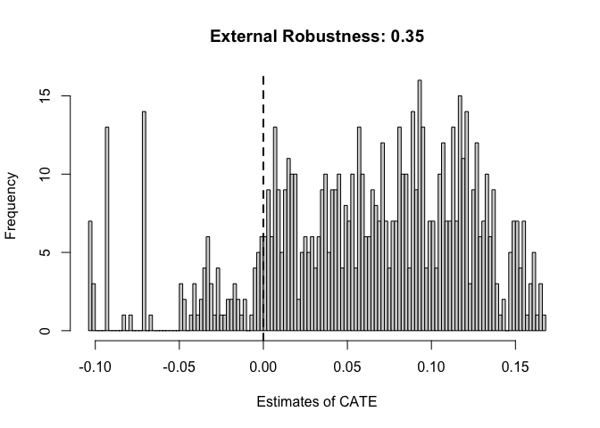
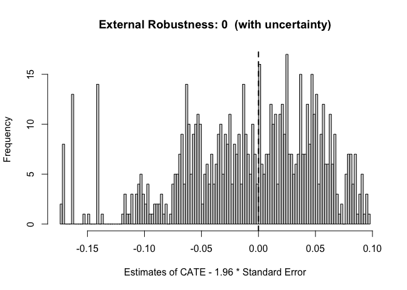

# exr: Quantifying Robustness to External Validity Bias

**Description:**

R package `exr` estimates robustness of experimental results to external
validity bias. Please read Devaux and Egami (2022+) for details about
the proposed method.

**Authors:**

-   [Naoki Egami](https://naokiegami.com) (Maintainer)
-   [Martin
    Devaux](https://polisci.columbia.edu/content/martin-samuel-devaux)

**Reference:**

-   Devaux and Egami. (2022+). [Quantifying Robustness to External
    Validity Bias.](https://naokiegami.com/paper/external_robust.pdf)
    (Working Paper).

**Overview:**

External validity of experimental results is essential in the social
sciences. Existing methods for external validity estimate causal effects
in a target population, called the target population average treatment
effect (T-PATE). However, these methods are sometimes difficult to
implement either because it is infeasible to obtain data for the target
population or because there is no target population that analysts and
skeptics can agree on. Devaux and Egami (2022+) consider a different
goal — quantifying how robust an experiment is to external validity
bias. In particular, Devaux and Egami (2022+) propose a measure of
*external robustness* by estimating how much different populations
should be from the experimental sample to explain away the T-PATE. This
R package `exr` allows users to estimate external robustness.

The three advantages of the proposed approach are as follows.

1.  Unlike the standard generalization approach, estimation of external
    robustness only requires experimental data and does not require any
    population data. In practice, researchers can estimate external
    robustness in any experimental study without collecting additional
    data.

2.  We prove that the proposed estimator is consistent to the true
    external robustness under common generalization assumptions and,
    more importantly, has simple interpretation even when those
    assumptions are violated.

3.  We provide simple default benchmarks to help interpret the degree of
    external robustness in each application.

## Practical Guides

-   **Step 1**: Users specify `covariates` that are important for
    treatment effect heterogeneity.

-   **Step 2**: Users can run `exr()` to estimate external robustness as
    a measure between 0 and 1.

-   **Step 3**: Users can run `summary()` to summarize results.
    `summary()` displays benchmarks (0.14 and 0.57) to help
    substantively interpret the degree of estimated external robustness.

    -   To provide further understanding of external robustness,
        researchers can also report covariate profiles of the population
        for which the T-PATE is equal to zero. `summary()` displays the
        means and standard deviations of covariates in the experimental
        sample and the population with the T-PATE equal to zero.
    -   Users can visualize the distribution of CATEs and estimated
        external robustness using `plot()`.

## Installation Instructions

You can install the most recent development version using the `devtools`
package. First you have to install `devtools` using the following code.
Note that you only have to do this once:

``` r
if(!require(devtools)) install.packages("devtools")
```

Then, load `devtools` and use the function `install_github()` to install
`exr`:

``` r
library(devtools)
install_github("naoki-egami/exr", dependencies = TRUE)
```

## Get Started

Here, we provide an example to illustrate the use of function `exr()`.

### First Estimate the SATE.

Researchers can first use their favoriate approach to estimate the
sample average treatment effect (SATE).

``` r
library(exr)
data(LaLonde) # Use LaLonde data as an example

covariates <- c("age", "educ", "black","hisp", "marr", "nodegr", "log.re75","u75") 
for_sate <- as.formula(paste0("outcome ~ treat + ", paste(covariates, collapse = "+")))

lm_sate <- lm(for_sate, data = LaLonde)
sate_est <- summary(lm_sate)$coef["treat", c(1,2)]
sate_est
```

    ##   Estimate Std. Error 
    ## 0.06965018 0.03563844

### Estimate External Robustness

Then, researchers can use `exr()` to estimate external robustness. In
most scenarios, users only need to specify the following 5 arguments. We
describe other optinal arguments in the package
[manual](https://github.com/naoki-egami/exr/blob/master/manual/exr_0.1.0.pdf).

| Argument        | Description                                                                                                                                                                                                                                                                                                                                                      |
|:-------------------|:---------------------------------------------------|
| `outcome`       | A variable name in the data that corresponds to the outcome variable.                                                                                                                                                                                                                                                                                            |
| `treatment`     | A variable name in the data that corresponds to the treatment variable. The treatment variable needs to be binary (i.e., contains two levels). If users are interested in categorical treatments (e.g., control, treatment 1, and treatment 2), they can estimate external robustness by running `exr()` twice; using treatment 1 and treatment 2, respectively. |
| `covariates`    | A vector. Variable names in the data that correspond to covariates users adjust for.                                                                                                                                                                                                                                                                             |
| `data`          | A data frame. The class should be `data.frame`.                                                                                                                                                                                                                                                                                                                  |
| `sate_estimate` | A vector of length 2. A point estimate of the SATE and its standard error. Default is `NULL`. When `sate_estimate = NULL`, the package internally estimates the SATE using a linear regression of the outcome on the treatment and all specified covariates.                                                                                                     |

``` r
exr_out <- exr(outcome = "outcome", 
               treatment = "treat", 
               covariates = c("age", "educ", "black","hisp", "marr", "nodegr", "log.re75","u75"), 
               data = LaLonde,
               sate_estimate = sate_est) 
```

    ## Estimating CATE with grf...
    ## Estimating External Robustness...

``` r
summary(exr_out)
```

    ## 
    ## CATE Estimator: grf
    ## 
    ## -------------------------
    ## External Robustness: 0.35
    ## -------------------------
    ## 
    ##    Estimate   With Uncertainty 
    ##    0.349225 *                0 
    ## ---
    ## Note: 0 ' ' 0.14 (Probability Surveys) '*' 0.57 (MTurk Samples) '**' 1
    ## 
    ## 
    ## -------------------
    ## Covariate Profiles:
    ## -------------------
    ## 
    ##          Exp:Mean Exp:SD   Pop*:Mean Pop*:SD   Std. Diff
    ## age         24.52   6.63       22.99    6.35        0.23
    ## educ        10.27   1.70        9.81    1.69        0.27
    ## black1       0.80   0.40        0.79    0.41        0.02
    ## hisp1        0.11   0.31        0.12    0.32       -0.04
    ## marr1        0.16   0.37        0.10    0.30        0.16
    ## nodegr1      0.78   0.41        0.84    0.37       -0.14
    ## log.re75     4.78   4.01        4.15    4.11        0.16
    ## u751         0.40   0.49        0.48    0.50       -0.17
    ## ---
    ## Note: Exp = Experimental sample. Pop* = Population with the T-PATE equal to zero.

In this example, external robustness is 0.35 and is moderate (between
two benchmarks 0.14 and 0.57).

The covariate profiles provide further intuitive understanding. The
first four columns show the means and standard deviation of covariates
in the experimental sample and in the population with the T-PATE equal
to zero. The last column shows the standardized difference in means of
covariates. If the population with the zero T-PATE has similar means of
covariates to those of the experimental sample, this shows that the
T-PATE is zero even in populations that are only slightly different from
the experimental sample. In contrast, if the population with the zero
T-PATE has distinct means of covariates from those of the experimental
sample, it shows that causal conclusions are robust to a wide range of
populations.

In this example, causal effects are robust to changes in many variables
for about 0.2 \~ 0.3 standard deviations, while it is robust to changes
in “race” variable for less than 0.1 standard deviations.

Use `plot` to visualize the estimated CATEs and estimated external
robustness.

``` r
plot(exr_out)
```



When `uncertainty = TRUE`, we visualize the distribution of CATEs that
are shifted based on an adjusted threshold. For example, suppose the
SATE is positive and we consider the 95% confidence interval. Then, the
adjusted threshold is 1.96 x Standard Error. Therefore, we visualize the
distribution of CATEs - 1.96 x Standard Error.

``` r
plot(exr_out, uncertainty = TRUE)
```



### Export Outputs for Papers

We can export the covariate profiles using `xtable` as the LaTeX output.

``` r
xtable(exr_out)
```

    ## % latex table generated in R 4.0.2 by xtable 1.8-4 package
    ## % Sun Oct 23 21:37:35 2022
    ## \begin{table}[ht]
    ## \centering
    ## \begin{tabular}{l||c|c||c}
    ##    & Experimental & Population with & Standardized \\ 
    ##    & Sample & T-PATE = 0 & Difference \\ 
    ##    \hline
    ## age & 24.52 & 22.99 & 0.23 \\ 
    ##    & (6.63) & (6.35) &  \\ 
    ##   educ & 10.27 & 9.81 & 0.27 \\ 
    ##    & (1.7) & (1.69) &  \\ 
    ##   black1 & 0.8 & 0.79 & 0.02 \\ 
    ##    & (0.4) & (0.41) &  \\ 
    ##   hisp1 & 0.11 & 0.12 & -0.04 \\ 
    ##    & (0.31) & (0.32) &  \\ 
    ##   marr1 & 0.16 & 0.1 & 0.16 \\ 
    ##    & (0.37) & (0.3) &  \\ 
    ##   nodegr1 & 0.78 & 0.84 & -0.14 \\ 
    ##    & (0.41) & (0.37) &  \\ 
    ##   log.re75 & 4.78 & 4.15 & 0.16 \\ 
    ##    & (4.01) & (4.11) &  \\ 
    ##   u751 & 0.4 & 0.48 & -0.17 \\ 
    ##    & (0.49) & (0.5) &  \\ 
    ##   \end{tabular}
    ## \end{table}

We can also export the PDF of the plot as follows.

``` r
pdf("figure.pdf")
plot(exr_out)
dev.off()
```
